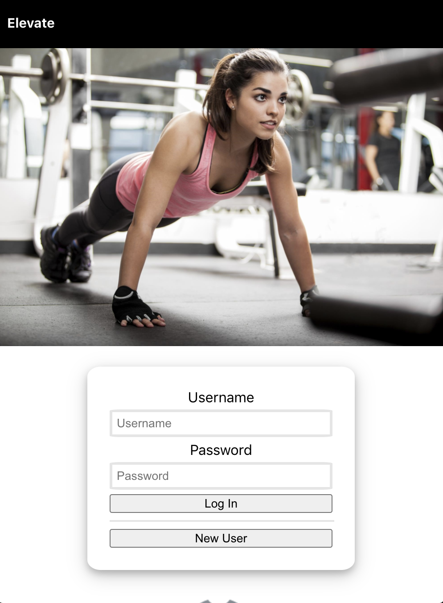
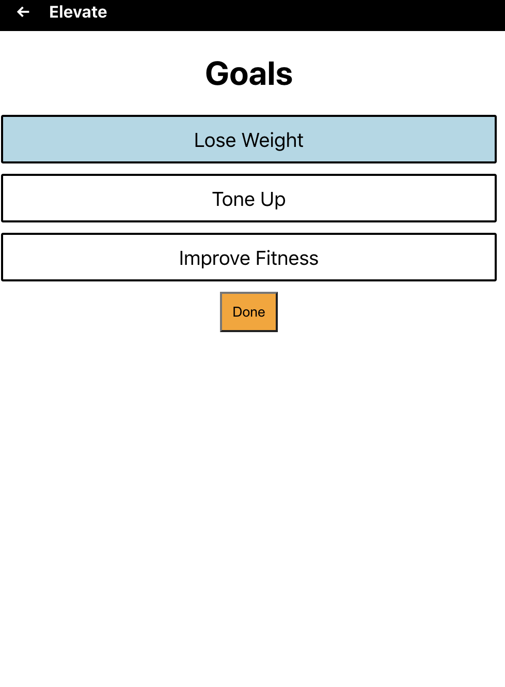
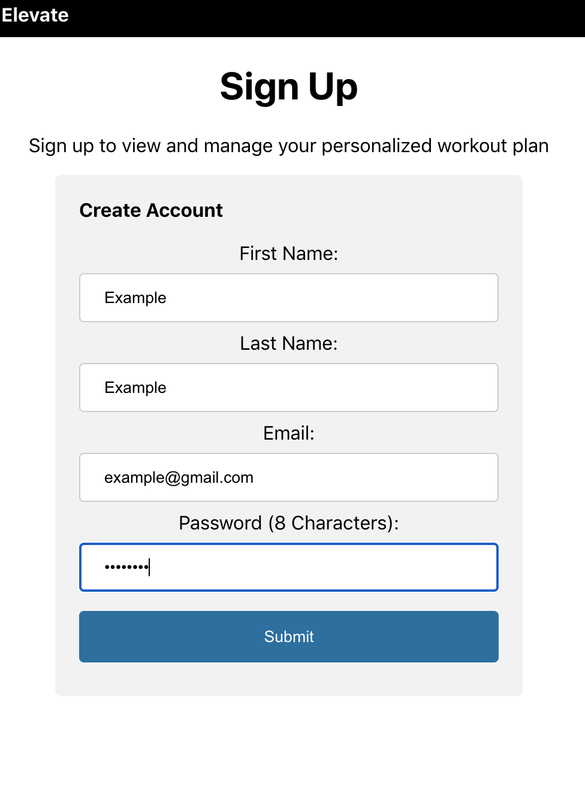
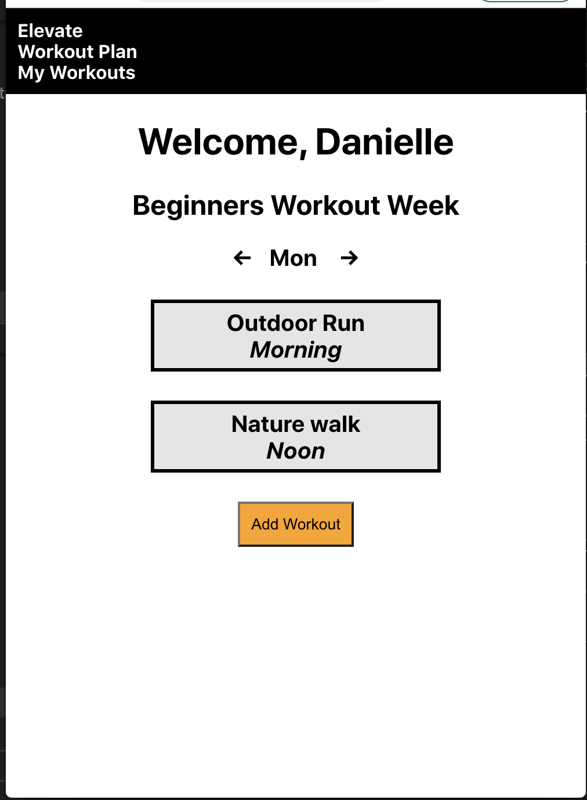
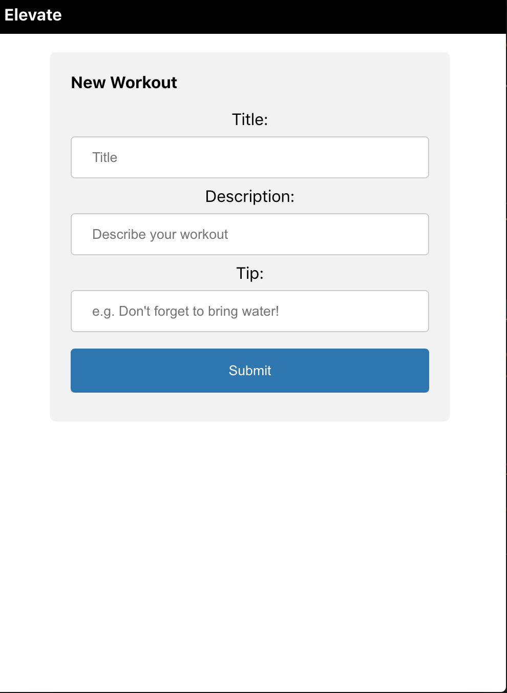
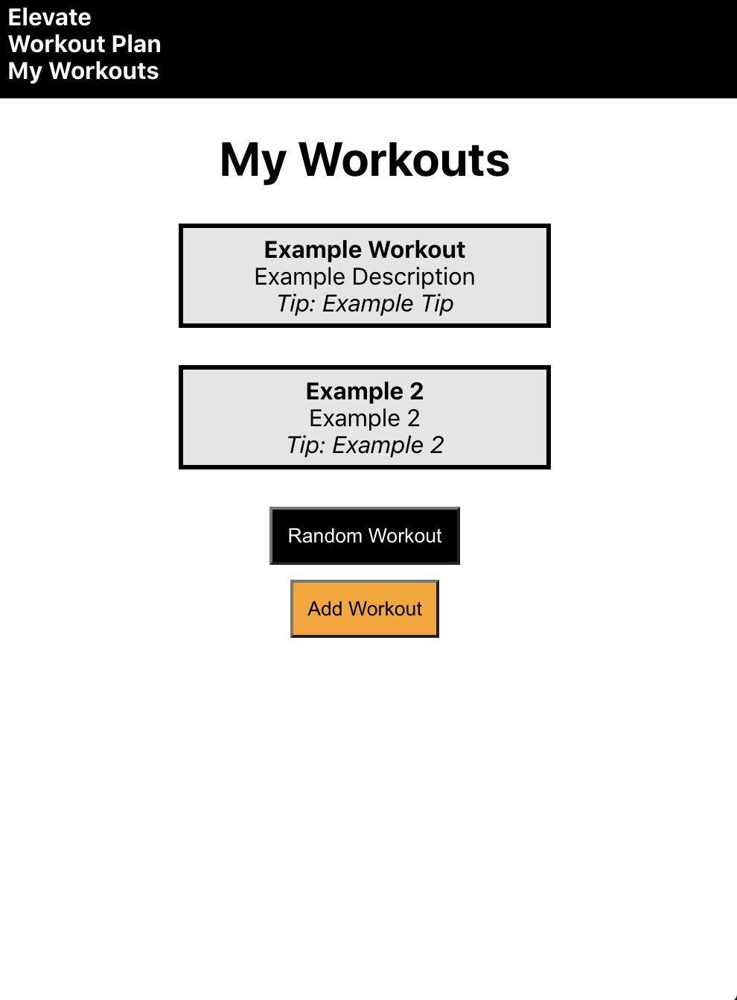

## Elevate

### Live Link: https://elevate-app.danielle-russell.vercel.app
### Repository Link for API: https://github.com/Danielle-Russell/elevate-api.git

### Summary

Elevate is a fullstack, interactive web app that designs a worokout plan for users based on their selections. It also provides the ability for users to add their own workouts, and to generate random workouts from their list is they are having trouble finding a starting point for their workout.

### Technology

The front-end of this application was built using React.js. The back end was built using Node.js with Express. I used React Router for my routing.

### Landing Page 

### Questions

### Sign Up

### Workout Plan

### Add Workout 

### My Workouts 

